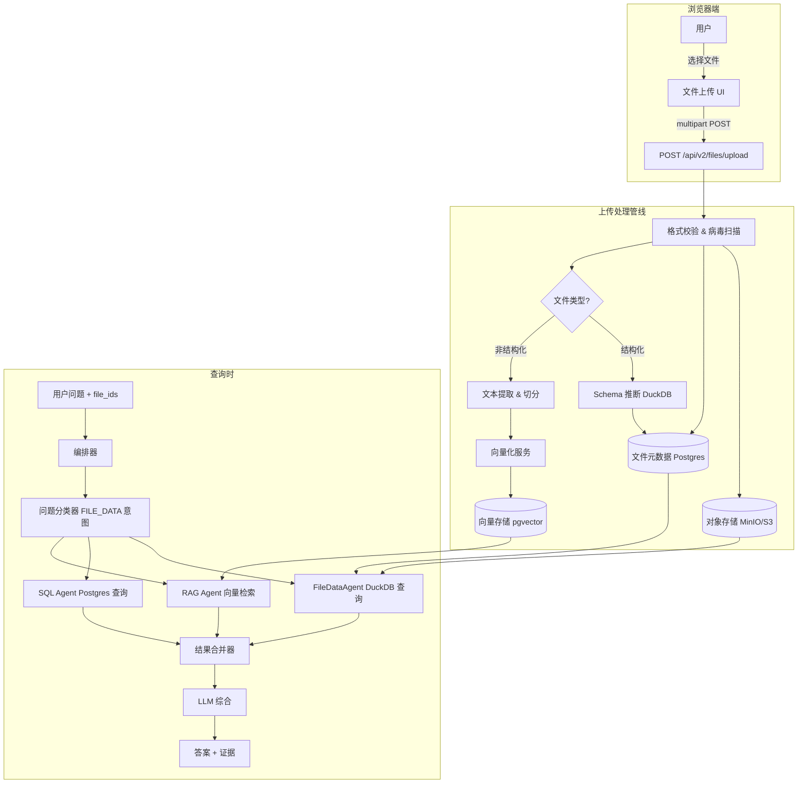
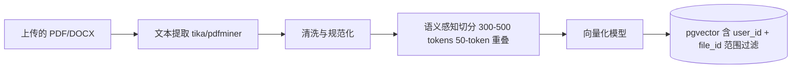
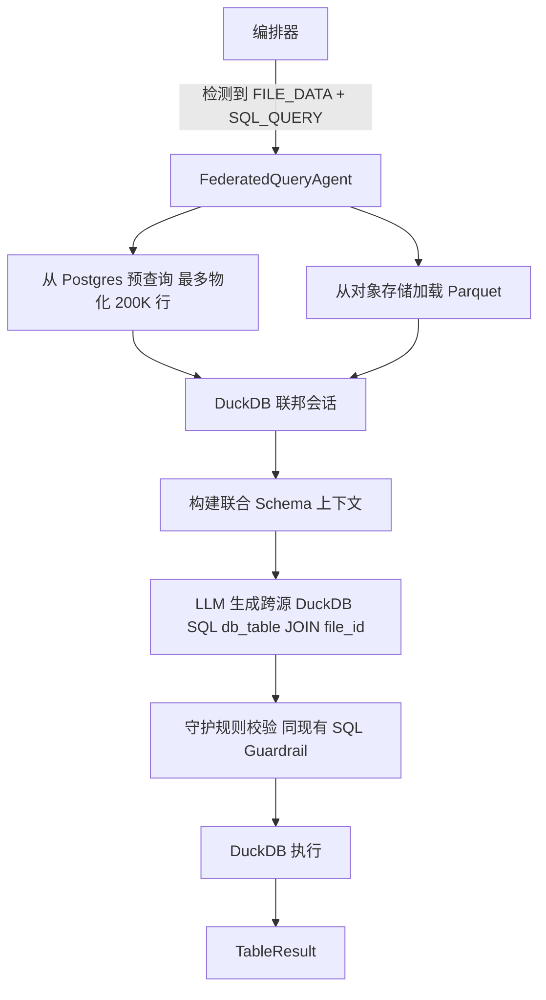

# 10 用户文件上传与混合数据分析

## 1. 解决的问题

企业分析师和数据人员日常工作中经常接触到大量游离于中央数据仓库之外的文件：财务部门的预算电子表格、CRM 导出的客户分群数据、Excel 格式的预测模型，以及 PDF 格式的事故复盘报告。

现阶段的 ChatBI 只能针对受治理的 PostgreSQL 数据库回答问题，无法将用户手头的私有文件纳入对话，更无法将其与生产数据进行联合分析。

本设计旨在弥补这一缺口：允许任何经过授权的用户上传文件，并在同一个受治理、可审计的对话会话中，提出跨越上传文件与现有数据库的复合问题。

---

## 2. 上传数据的两种处理模式

每一个上传文件根据其格式，归属于以下两种处理模式之一。

| 模式 | 支持格式 | 使用方式 |
|---|---|---|
| **结构化** | CSV、XLSX、XLS、TSV、JSON（表格型） | 解析为会话内虚拟表；Agent 可通过 DuckDB 将其与数据库表进行 JOIN |
| **非结构化** | PDF、DOCX、TXT、MD、PPTX | 切分并向量化；RAG Agent 检索段落作为自然语言回答的证据 |

单次上传会话可同时包含两种类型的文件。

---

## 3. 端到端架构



---

## 4. 存储层

### 4.1 对象存储

所有原始上传文件存储在对象存储中（本地部署使用 MinIO，云部署使用 S3）。

```
存储桶：chatbi-user-files
键路径：{org_id}/{user_id}/{file_id}/{original_filename}
```

文件不对外公开访问。下载需要由服务端生成有效期为 15 分钟的签名 URL。

### 4.2 文件元数据表

```sql
CREATE TABLE user_uploaded_files (
    file_id         TEXT PRIMARY KEY,
    org_id          TEXT NOT NULL,
    user_id         TEXT NOT NULL,
    original_name   TEXT NOT NULL,
    file_type       TEXT NOT NULL,         -- 'structured' | 'unstructured'
    mime_type       TEXT NOT NULL,
    size_bytes      BIGINT NOT NULL,
    storage_key     TEXT NOT NULL,
    schema_json     JSONB,                 -- 列名与列类型（仅结构化文件）
    row_count       INTEGER,               -- 仅结构化文件
    chunk_count     INTEGER,               -- 仅非结构化文件
    status          TEXT NOT NULL DEFAULT 'processing',
    scope           TEXT NOT NULL DEFAULT 'session',   -- 'session' | 'user' | 'team'
    session_id      TEXT,
    created_at      TIMESTAMPTZ NOT NULL DEFAULT NOW(),
    expires_at      TIMESTAMPTZ,
    deleted_at      TIMESTAMPTZ
);

CREATE INDEX ON user_uploaded_files (org_id, user_id, created_at DESC);
CREATE INDEX ON user_uploaded_files (session_id, status);
```

### 4.3 会话内结构化数据（DuckDB）

结构化文件上传完成后，处理管线执行以下步骤：

1. 从对象存储下载原始文件。
2. 使用 DuckDB 推断列类型，并生成 Parquet 快照。
3. 将 Parquet 文件与原始文件一并存储至对象存储。
4. 将推断出的 schema 写入 `schema_json` 字段。

查询时，`FileDataAgent` 启动一个 DuckDB 进程内会话，读取 Parquet 文件并对其执行 SQL。跨文件与 PostgreSQL 数据的 JOIN，通过 DuckDB 的 `postgres_scan` 扩展，或将 Postgres 数据样本物化到 DuckDB 内存中完成。

---

## 5. 上传 API

### 5.1 接口定义

```
POST /api/v2/files/upload
Content-Type: multipart/form-data
Authorization: Bearer <token>

字段说明：
  file        — 二进制文件内容
  scope       — "session" | "user" | "team"（默认：session）
  session_id  — scope = "session" 时必填
  description — 可选的人可读描述标签
```

### 5.2 响应示例

```json
{
  "trace_id": "tr_...",
  "request_id": "req_...",
  "data": {
    "file_id": "ufile_abc123",
    "original_name": "q2_forecast.xlsx",
    "file_type": "structured",
    "status": "processing",
    "schema": null,
    "size_bytes": 204800,
    "created_at": "2026-07-06T10:00:00Z"
  },
  "warnings": [],
  "error": null
}
```

处理为异步流程。客户端轮询 `GET /api/v2/files/{file_id}`，直到 `status` 变为 `ready` 或 `failed`。

### 5.3 其他接口

| 方法 | 路径 | 用途 |
|---|---|---|
| `GET` | `/api/v2/files` | 列出用户文件（分页，可按 scope / status 过滤） |
| `GET` | `/api/v2/files/{file_id}` | 获取文件元数据和 schema |
| `DELETE` | `/api/v2/files/{file_id}` | 软删除文件 |
| `GET` | `/api/v2/files/{file_id}/preview` | 返回前 50 行（结构化）或前 3 个片段（非结构化） |

---

## 6. 含上传文件的查询流程

用户提交对话查询时，可以可选地附带一个或多个 `file_ids`：

```json
{
  "request_id": "req_...",
  "session_id": "ses_...",
  "question": "请将我上传的 Q2 预测数据与数据库中的实际营收进行对比分析。",
  "file_ids": ["ufile_abc123"],
  "locale": "zh-CN",
  "role": "analyst"
}
```

### 6.1 问题分类器扩展

新增 `TaskType.FILE_DATA`。分类器通过以下信号检测文件意图：

1. 请求体中显式传入 `file_ids`（决定性信号）。
2. 关键词识别：`我的文件`、`上传的`、`这张表`、`我的数据`、`我的预测`、`对比一下`、`我的数字`等。

如果 `FILE_DATA` 与 `SQL_QUERY` 同时触发，则两个 Agent 并行运行，结果在合并器中汇总。

### 6.2 FileDataAgent

```
FileDataAgent 执行逻辑：
  输入：file_id 列表、用户问题、角色
  步骤：
    1. 从 Postgres 查询文件元数据
    2. 校验文件归属与 status = 'ready'
    3. 从对象存储下载 Parquet 文件
    4. 启动 DuckDB 进程内会话
    5. LLM 根据文件 schema 生成 DuckDB SQL
    6. 应用与 SQL Agent 相同的守护规则（禁止写操作、禁止受限函数）
    7. 执行查询
    8. 返回 TableResult
```

### 6.3 跨数据源结果合并

`ResultMerger` 接收所有活跃 Agent 的输出，并为 LLM 综合器生成统一上下文。

```
ResultMerger 策略：
  - FileDataAgent 与 SQL Agent 均返回表格时：
      → 将两张表以独立标签传给 LLM
      → LLM 负责叙述比较结论（不在 Python 层执行 JOIN）
  - 仅 FileDataAgent 返回数据时：
      → 仅基于文件数据作答
  - RAG Agent 返回证据时：
      → 将段落证据与表格数据一并作为上下文传给 LLM
```

---

## 7. 非结构化文件处理管线

PDF、DOCX 等文件遵循与现有 RAG 知识文档相同的摄取流程，但会打上 user/org/session 范围标签，确保不会被其他用户检索到。



检索时，RAG Agent 在向量相似度搜索前应用元数据过滤：`user_id = 当前用户 AND file_id IN 请求中的 file_ids`。

---

## 8. 安全与治理

### 8.1 数据隔离

- 文件以 `(org_id, user_id)` 为粒度进行隔离。
- 同一组织内，用户无法访问他人的文件，除非文件被显式共享（scope = `team` 且满足团队成员资格校验）。
- 针对上传文件的 DuckDB 查询经过与 Postgres SQL 相同的守护规则引擎处理：写操作一律拒绝。

### 8.2 文件校验规则

| 检查项 | 规则 |
|---|---|
| 格式白名单 | 仅允许 CSV、XLSX、XLS、TSV、JSON、PDF、DOCX、TXT、MD、PPTX |
| 文件大小限制 | 单文件不超过 50 MB；每用户总存储上限 500 MB |
| 病毒扫描 | 任何处理开始前，先经过 ClamAV 或同等工具扫描 |
| 内容类型校验 | 声明的 MIME 类型必须与文件魔数字节一致 |
| 行数限制 | 超过 100 万行的结构化文件拒绝处理 |

### 8.3 审计追踪

每次文件的上传、查询、预览和删除操作均记录至现有的 `chatbi_query_audit_log`，并在 schema 中新增 `file_ids_used` JSON 列。

### 8.4 保留策略

| 范围 | 自动过期 |
|---|---|
| `session`（会话级） | 会话最后活跃后 24 小时 |
| `user`（用户级） | 最后访问后 30 天 |
| `team`（团队级） | 90 天，或由所有者 / 管理员手动删除 |

后台 Worker 每日运行一次，清理对象存储中的过期文件，并软删除对应的元数据记录。

---

## 9. 前端设计

### 9.1 文件附件栏

问题输入框下方出现一个可折叠的附件栏。用户点击 `+` 打开文件选择器，或直接将文件拖拽到输入框上方。

```
┌─────────────────────────────────────────────────────────┐
│  请输入您的问题…                                          │
│                                                          │
│  [+ 附件]  q2_forecast.xlsx ✕   incidents.pdf ✕         │
└─────────────────────────────────────────────────────────┘
```

已附加文件以标签片（chip）形式展示，带有移除按钮，并显示上传状态（上传中转圈 → 就绪 → 失败）。

### 9.2 文件库侧边抽屉

侧边栏提供一个抽屉面板，展示用户在所有范围内保存的文件。每条记录显示：文件名、状态、行数或片段数、创建时间、范围标识，以及删除按钮。

### 9.3 答案来源标注

当答案使用了文件数据时，答案区域展示：

- 来自上传文件的表格结果旁显示 `文件数据` 来源标识。
- 非结构化文件片段的证据卡，与现有 RAG 证据卡风格保持一致，但显示 `📎 已上传` 标签。

---

## 10. 数据模型总览

```
user_uploaded_files           → 文件元数据、schema、状态、范围
对象存储                       → 原始文件 + Parquet 快照
pgvector（知识库向量存储）      → 非结构化文件的分片（用户范围隔离）
chatbi_query_audit_log        → 扩展增加 file_ids_used 字段
```

---

## 11. 后续工作解决方案设计

前几节提出了五个待决问题。本节对每一项给出具体的设计方案。

---

### 11.1 团队文件协作

**问题**：团队范围文件应该对组织内所有分析师可见，还是仅限于显式指定的成员？

**设计决策：两档共享粒度**

不引入独立的"团队"实体，而是在 `scope` 字段上区分两种共享模式，避免增加团队管理的运维开销：

| scope 值 | 含义 |
|---|---|
| `org` | 组织内所有 `analyst` 和 `admin` 角色均可只读访问 |
| `team` | 仅限文件所有者在 `user_file_shares` 表中显式授权的用户 |

新增共享授权表：

```sql
CREATE TABLE user_file_shares (
    share_id    TEXT PRIMARY KEY,
    file_id     TEXT NOT NULL REFERENCES user_uploaded_files(file_id),
    granted_by  TEXT NOT NULL,   -- 授权人 user_id
    granted_to  TEXT NOT NULL,   -- 被授权人 user_id
    permission  TEXT NOT NULL DEFAULT 'read',  -- 'read'（只读，暂不支持写）
    created_at  TIMESTAMPTZ NOT NULL DEFAULT NOW(),
    revoked_at  TIMESTAMPTZ
);
CREATE UNIQUE INDEX ON user_file_shares (file_id, granted_to)
    WHERE revoked_at IS NULL;
```

**权限检查逻辑**（文件访问时执行）：

```
allowed = (
    file.user_id == current_user_id
    OR (file.scope == 'org' AND file.org_id == current_org_id AND current_role IN ['analyst','admin'])
    OR (file.scope == 'team' AND EXISTS share WHERE share.granted_to == current_user_id AND share.revoked_at IS NULL)
    OR current_role == 'admin'
)
```

**前端**：文件库抽屉中每条记录增加"分享"按钮，打开后输入同组织的用户邮箱进行授权，或一键切换为组织可见。

---

### 11.2 Schema 演化与版本管理

**问题**：用户重新上传修订版文件时，历史查询应使用旧 schema 还是新 schema？

**设计决策：版本链 + 查询时锚定版本**

每次上传同名文件不覆盖原记录，而是创建一个新版本，通过 `file_group_id` 将同一"文件身份"的多个版本串联起来。

```sql
ALTER TABLE user_uploaded_files
    ADD COLUMN file_group_id TEXT,    -- 同一文件的所有版本共享此 ID
    ADD COLUMN version_number INTEGER NOT NULL DEFAULT 1,
    ADD COLUMN is_latest      BOOLEAN NOT NULL DEFAULT TRUE;

CREATE INDEX ON user_uploaded_files (file_group_id, version_number DESC);
```

**上传流程变更**：

```
上传时：
  1. 检查是否存在同名 file_group（按 org_id + user_id + original_name 匹配）
  2. 若存在：
       a. 将旧版本的 is_latest 设为 FALSE
       b. 新记录 version_number = max(旧版本) + 1，is_latest = TRUE
       c. 复用同一 file_group_id
  3. 若不存在：生成新 file_group_id，version_number = 1
```

**审计日志扩展**：

`chatbi_query_audit_log` 中 `file_ids_used` 字段存储的是具体的 `file_id`（即版本快照 ID），而不是 `file_group_id`。这样历史查询天然锚定到当时使用的版本，不受后续上传影响。

**前端行为**：
- 新对话中选择文件时，默认使用 `is_latest = TRUE` 的版本。
- 文件库抽屉中同一 `file_group` 的多个版本可展开查看，每个版本可单独下载或作为附件引用。

---

### 11.3 大文件分片流式上传

**问题**：单文件 50 MB 限制对高级用户不够用。

**设计决策：客户端分片 + 直传对象存储**

避免大文件经过后端服务中转，客户端直接将分片上传至对象存储，后端只协调元数据。

**新增两个协调接口**：

```
POST /api/v2/files/upload/init
Body: { original_name, file_size_bytes, mime_type, scope, session_id? }
Response: {
  upload_id: "upl_...",
  chunk_size_bytes: 5242880,   // 5 MB
  chunk_count: 42,
  presigned_urls: [            // 每个分片一个预签名 PUT URL，有效期 30 分钟
    { chunk_index: 0, url: "https://minio/..." },
    ...
  ]
}

POST /api/v2/files/upload/{upload_id}/complete
Body: { etags: [{ chunk_index, etag }, ...] }   // 客户端收集每片上传返回的 ETag
Response: { file_id, status: "processing" }
```

**后端后处理（异步 Worker）**：

```
完成后：
  1. 调用 MinIO / S3 CompleteMultipartUpload 合并分片
  2. 下载文件并启动 DuckDB 流式读取（分批次，每批 100K 行）
     → 立即生成 schema 快照存入元数据（status = 'schema_ready'）
     → 继续后台处理剩余行，生成完整 Parquet（status = 'ready'）
  3. 对非结构化文件：流式提取文本后台切分+向量化，每批完成后 status = 'indexing'，全部完成后 'ready'
```

**分角色文件大小上限**：

| 角色 | 单文件上限 | 用户总存储 |
|---|---|---|
| `business_user` | 50 MB | 500 MB |
| `analyst` | 500 MB | 5 GB |
| `admin` | 2 GB | 20 GB |

---

### 11.4 FederatedQueryAgent：跨源真实 JOIN

**问题**：当前 LLM 仅叙述对比结论，不执行真实 SQL JOIN。

**设计决策：DuckDB 联邦会话，双源物化后执行 JOIN**

引入新的 `FederatedQueryAgent`，替代当前的"LLM 叙述"策略。

**执行流程**：



**DuckDB 会话内的命名规范**：

```sql
-- Postgres 数据以 db_ 前缀注册为视图
CREATE VIEW db_sales AS SELECT * FROM read_parquet('/tmp/pg_sales_sample.parquet');

-- 上传文件以 file_ 前缀注册
CREATE VIEW file_ufile_abc123 AS SELECT * FROM read_parquet('/tmp/user_file.parquet');

-- LLM 生成的联合查询示例
SELECT
    db_sales.month,
    db_sales.actual_revenue,
    file_ufile_abc123.forecast_revenue,
    db_sales.actual_revenue - file_ufile_abc123.forecast_revenue AS variance
FROM db_sales
JOIN file_ufile_abc123 ON db_sales.month = file_ufile_abc123.month
ORDER BY db_sales.month;
```

**安全边界**：

| 限制项 | 规则 |
|---|---|
| Postgres 物化行数上限 | 200K 行；超出时降级为 LLM 叙述模式并告知用户 |
| DuckDB 内存上限 | 2 GB；超出时中止查询返回 `QUERY_RESOURCE_EXCEEDED` |
| 禁止的操作 | CREATE / INSERT / UPDATE / DELETE / DROP（与现有守护规则一致） |
| JOIN 列的类型兼容性校验 | LLM 提示词中提供两侧 schema，要求 LLM 检查类型匹配 |

**降级策略**：当 Postgres 数据量超出阈值，或 LLM 未能生成有效 JOIN SQL 时，自动回退到当前的"分别查询 + LLM 叙述"模式，并在答案区显示提示：「由于数据量较大，本次使用对比叙述而非直接联合查询」。

---

### 11.5 文件提升为团队知识库

**问题**：团队范围文件应可由管理员提升为组织级 RAG 知识库的正式成员。

**设计决策：管理员"提升"操作 + 双向可追溯**

**新增管理员接口**：

```
POST /api/v2/admin/knowledge/promote-file
Body: {
  file_id: "ufile_abc123",
  target_collection: "official",     // 目标知识库集合
  title_override: "Q2 2026 Revenue Forecast",   // 可选，覆盖原文件名
  access_policy: { roles: ["analyst", "admin"] }
}
Response: { doc_id: "doc_...", status: "promoting" }
```

**提升流程（异步 Worker）**：

```
1. 在 knowledge.documents 中创建新记录
   source_type = 'user_promoted'，promoted_from_file_id = file_id
2. 将 pgvector 中该 file_id 对应的所有 chunk 复制到正式知识库
   去除 user_id 过滤标签，改挂 doc_id
3. 将原始文件的 Parquet / 原始件复制到知识库专用存储桶路径
4. 更新 user_uploaded_files 记录：
   promoted_to_doc_id = doc_id，scope 追加 'promoted' 标记
5. 完成后向原文件所有者发送系统通知
```

**双向可追溯**：

```sql
-- 查询某知识库文档的来源文件
SELECT uf.original_name, uf.user_id, uf.created_at
FROM knowledge.documents kd
JOIN user_uploaded_files uf ON uf.file_id = kd.promoted_from_file_id
WHERE kd.doc_id = 'doc_xyz';

-- 查询某文件是否已被提升及对应文档
SELECT promoted_to_doc_id, scope
FROM user_uploaded_files
WHERE file_id = 'ufile_abc123';
```

**回滚（降级）**：管理员可通过 `DELETE /api/v2/admin/knowledge/{doc_id}?mode=demote` 将文档从知识库移除，同时恢复向量存储中的用户范围过滤标签，原用户文件记录保持不变。

**治理约束**：
- 只有 `admin` 角色可执行提升和降级操作。
- 提升后，原文件所有者仍然可以删除自己的用户文件记录，但知识库侧的文档独立存活（两者解耦）。
- 提升记录写入 `chatbi_query_audit_log`，`event_type = 'file_promoted_to_knowledge'`。

---

## 12. 五项解决方案总览

| 问题 | 核心决策 | 关键约束 |
|---|---|---|
| 团队协作 | 两档 scope（org / team）+ 显式授权表 | 不引入独立团队实体，降低运维复杂度 |
| Schema 演化 | 版本链 + 查询时锚定版本快照 ID | 审计日志存 file_id 而非 group_id |
| 大文件上传 | 客户端分片直传对象存储 + 流式后处理 | 按角色分级限额；流式保证 UI 响应 |
| 跨源 JOIN | FederatedQueryAgent + DuckDB 联邦会话 | Postgres 物化上限 200K 行；超出降级 |
| 知识库提升 | 管理员一键提升 + 向量存储复制 + 双向可追溯 | 提升与原文件生命周期解耦 |

## 13. 后续设计

实现完成后的复盘评审中，发现 RAG 知识库存在一个真实的跨租户数据泄露问题，也进一步完善了分享/保留模型。详见 [10-followups/](10-followups/README.zh-CN.md)：RAG 按用户隔离的修复方案、修正后的管理员审批分享流程、保留与自动归档的重新设计，以及多轮对话记忆设计。
