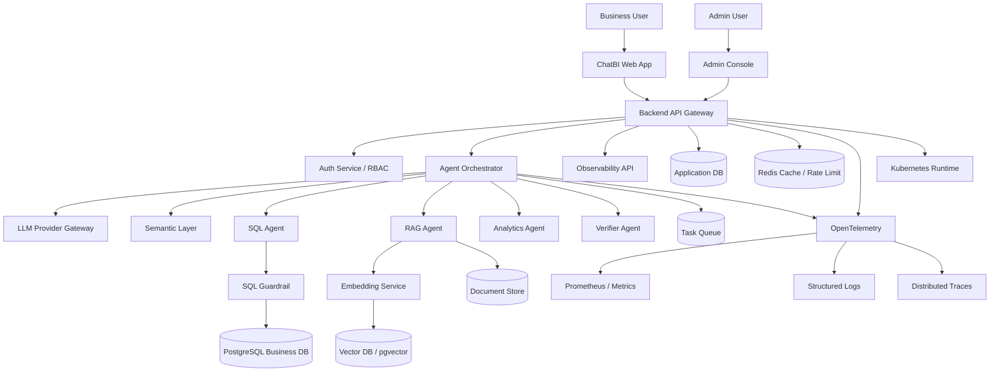

# Final Version 系统设计总目录

English Version: [../en/README.en.md](../en/README.en.md)

本文档集是本项目准备走向“工业级最终版本”的系统设计入口。前面的 `01` 到 `10` 号设计文档已经把 ChatBI 的核心模块拆开讲清楚了；这里的 `final-version` 目录负责回答另一个更接近真实工程的问题：

> 如果这个项目要提交给总监、准备云端部署、支持真实用户登录、接入真实大模型、做权限隔离、做可观测和压测，我们最终应该长成什么样？

一句话理解：旧文档偏“模块设计”，这里偏“生产系统蓝图”。

## 推荐阅读顺序

1. [00 总体提交版系统设计](00-executive-system-design.zh-CN.md)
2. [01 生产级总体架构](01-production-architecture.zh-CN.md)
3. [02 登录、注册、RBAC 与租户隔离](02-auth-rbac-tenant-isolation.zh-CN.md)
4. [03 大模型 Provider Gateway](03-llm-provider-gateway.zh-CN.md)
5. [04 Embedding、向量数据库与 RAG](04-embedding-vector-rag.zh-CN.md)
6. [05 数据平台、迁移与大规模测试数据](05-data-platform-and-seed.zh-CN.md)
7. [06 云端与 Kubernetes 部署](06-cloud-kubernetes-deployment.zh-CN.md)
8. [07 熔断、限流、抗压与高可用](07-resilience-and-scale.zh-CN.md)
9. [08 安全、可观测性与 Admin 控制台](08-security-observability-admin.zh-CN.md)
10. [09 最终交付路线图](09-final-delivery-roadmap.zh-CN.md)

## 最终目标架构图

## 当前版本和最终版本的差别

当前项目已经具备多智能体 ChatBI 的核心骨架：API、编排器、SQL Guardrail、RAG、分析预测、评估与可观测性等关键模块已经可以作为可运行 MVP 展示。

最终版本要补齐的是工业项目最看重的能力：

1. 真实用户体系：注册、登录、JWT/session、组织、角色、权限。
2. 真实大模型接入：OpenAI 或可替换 Provider、超时、重试、成本统计、模型路由。
3. 向量数据库与 embedding：让 RAG 真正能检索企业文档，而不是只停留在模拟逻辑。
4. Admin 权限隔离：评估、审计、trace、release gate 只能给管理员或授权角色看。
5. 大规模测试数据：可重复 seed、压测数据、评估数据、演示数据。
6. 分布式系统韧性：限流、熔断、重试、队列、降级、负载测试。
7. 云端部署：Docker 镜像、Kubernetes、Ingress、Secret、HPA、CI/CD。
8. 安全治理：多租户隔离、审计、敏感字段脱敏、密钥管理、最小权限。

## 怎么用这套文档推进开发

后面开发时不要“想到哪写到哪”。建议按下面顺序推进：

1. 先做 Auth/RBAC，因为没有权限边界，后面的 Admin 观测和多用户数据隔离都站不住。
2. 再做 LLM Gateway，因为真实大模型是 ChatBI 变成智能系统的入口。
3. 再做 Embedding + Vector DB，因为它决定 RAG 是否真正可用。
4. 接着补数据 seed、迁移和测试集，让系统能被验证。
5. 最后补 Kubernetes、熔断、压测和云端发布。

这就是从“课程项目”升级到“工业级项目”的主线。
