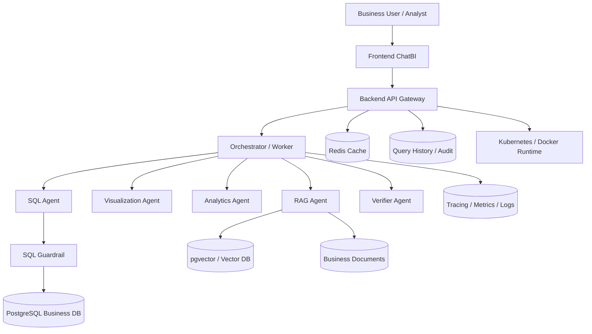

# System Design Master Index (English)

中文索引: [system-design-index.zh-CN.md](system-design-index.zh-CN.md)

This page is the single entry point to the full 10-part system design set for the Governed Multi-Agent ChatBI Platform. The v1 documents remain as detailed design baselines, and the v2 engineering upgrade documents add database integration, Docker-based local development, frontend/backend integration, Kubernetes deployment, and observability.

## Table of Contents

- [Global Architecture Diagram](#global-architecture-diagram)
- [How to Use This Index](#how-to-use-this-index)
- [Architecture Layer](#architecture-layer)
- [Data and Governance Layer](#data-and-governance-layer)
- [Experience and Intelligence Layer](#experience-and-intelligence-layer)
- [Quality and Operations Layer](#quality-and-operations-layer)
- [Full Document Map](#full-document-map)
- [Recommended Reading Paths](#recommended-reading-paths)

## Global Architecture Diagram

## v2 Engineering Upgrade Entry Points

- 01 Overall Architecture v2: [English](01-overall-architecture/VERSION2.en.md) / [Chinese](01-overall-architecture/VERSION2.zh-CN.md)
- 02 Agent Orchestration v2: [English](02-agent-orchestration-design/VERSION2.en.md) / [Chinese](02-agent-orchestration-design/VERSION2.zh-CN.md)
- 03 Semantic Layer and NL2SQL v2: [English](03-semantic-layer-and-nl2sql/VERSION2.en.md) / [Chinese](03-semantic-layer-and-nl2sql/VERSION2.zh-CN.md)
- 04 SQL Guardrail and Governance v2: [English](04-sql-guardrail-and-governance/VERSION2.en.md) / [Chinese](04-sql-guardrail-and-governance/VERSION2.zh-CN.md)
- 05 Data Model v2: [English](05-data-model-design/VERSION2.en.md) / [Chinese](05-data-model-design/VERSION2.zh-CN.md)
- 06 Backend API v2: [English](06-backend-api-design/VERSION2.en.md) / [Chinese](06-backend-api-design/VERSION2.zh-CN.md)
- 07 Frontend ChatBI v2: [English](07-frontend-chatbi-design/VERSION2.en.md) / [Chinese](07-frontend-chatbi-design/VERSION2.zh-CN.md)
- 08 RAG Retrieval and Evidence v2: [English](08-rag-design/VERSION2.en.md) / [Chinese](08-rag-design/VERSION2.zh-CN.md)
- 09 Analytics and Forecasting v2: [English](09-analytics-and-forecasting-design/VERSION2.en.md) / [Chinese](09-analytics-and-forecasting-design/VERSION2.zh-CN.md)
- 10 Evaluation and Observability v2: [English](10-evaluation-and-observability/VERSION2.en.md) / [Chinese](10-evaluation-and-observability/VERSION2.zh-CN.md)

## How to Use This Index

1. Start with the architecture section to understand overall boundaries and flow.
2. Continue with data/governance for model, policy, and API contracts.
3. Read frontend and RAG for user-facing and explanation layers.
4. Finish with analytics and quality operations for production readiness.

Quick jumps:

- [Doc 01](#doc-01-overall-architecture)
- [Doc 02](#doc-02-agent-orchestration)
- [Doc 03](#doc-03-semantic-layer-and-nl2sql)
- [Doc 04](#doc-04-sql-guardrail-and-governance)
- [Doc 05](#doc-05-data-model)
- [Doc 06](#doc-06-backend-api)
- [Doc 07](#doc-07-frontend-chatbi)
- [Doc 08](#doc-08-rag-retrieval-and-evidence)
- [Doc 09](#doc-09-analytics-and-forecasting)
- [Doc 10](#doc-10-evaluation-and-observability)

## Architecture Layer

### Doc 01: Overall Architecture

Anchor: [Doc 01](#doc-01-overall-architecture)

- English: [01-overall-architecture/README.en.md](01-overall-architecture/README.en.md)
- Chinese: [01-overall-architecture/README.zh-CN.md](01-overall-architecture/README.zh-CN.md)

Summary:

- End-to-end system layers and runtime topology
- Core workflow from question to verified answer
- Shared contracts, governance, and observability baseline

### Doc 02: Agent Orchestration

Anchor: [Doc 02](#doc-02-agent-orchestration)

- English: [02-agent-orchestration-design/README.en.md](02-agent-orchestration-design/README.en.md)
- Chinese: [02-agent-orchestration-design/README.zh-CN.md](02-agent-orchestration-design/README.zh-CN.md)

Summary:

- Orchestrator and specialized-agent boundaries
- Scheduling strategy, state machine, and confidence aggregation
- Degraded-path and partial-failure handling

## Data and Governance Layer

### Doc 03: Semantic Layer and NL2SQL

Anchor: [Doc 03](#doc-03-semantic-layer-and-nl2sql)

- English: [03-semantic-layer-and-nl2sql/README.en.md](03-semantic-layer-and-nl2sql/README.en.md)
- Chinese: [03-semantic-layer-and-nl2sql/README.zh-CN.md](03-semantic-layer-and-nl2sql/README.zh-CN.md)

Summary:

- Business semantic model and metric governance
- NL parsing, SQL planning/generation, and explainability
- Versioning and ambiguity fallback policy

### Doc 04: SQL Guardrail and Governance

Anchor: [Doc 04](#doc-04-sql-guardrail-and-governance)

- English: [04-sql-guardrail-and-governance/README.en.md](04-sql-guardrail-and-governance/README.en.md)
- Chinese: [04-sql-guardrail-and-governance/README.zh-CN.md](04-sql-guardrail-and-governance/README.zh-CN.md)

Summary:

- SQL policy engine and AST validation
- ACL, masking, rate/time/row limits
- Audit and replay model for risk control

### Doc 05: Data Model

Anchor: [Doc 05](#doc-05-data-model)

- English: [05-data-model-design/README.en.md](05-data-model-design/README.en.md)
- Chinese: [05-data-model-design/README.zh-CN.md](05-data-model-design/README.zh-CN.md)

Summary:

- Business, knowledge, runtime, and governance domains
- ER model, lineage, partitioning, lifecycle, and quality checks
- Storage strategy for OLTP, vector, cache, and audit data

### Doc 06: Backend API

Anchor: [Doc 06](#doc-06-backend-api)

- English: [06-backend-api-design/README.en.md](06-backend-api-design/README.en.md)
- Chinese: [06-backend-api-design/README.zh-CN.md](06-backend-api-design/README.zh-CN.md)

Summary:

- API grouping and endpoint catalog
- Unified request/response/error envelope
- Idempotency, pagination, rate limit, and observability contracts

## Experience and Intelligence Layer

### Doc 07: Frontend ChatBI

Anchor: [Doc 07](#doc-07-frontend-chatbi)

- English: [07-frontend-chatbi-design/README.en.md](07-frontend-chatbi-design/README.en.md)
- Chinese: [07-frontend-chatbi-design/README.zh-CN.md](07-frontend-chatbi-design/README.zh-CN.md)

Summary:

- Page architecture and component model
- Structured rendering for table/chart/evidence/risk
- UX states for loading, partial-failure, and degraded outputs

### Doc 08: RAG Retrieval and Evidence

Anchor: [Doc 08](#doc-08-rag-retrieval-and-evidence)

- English: [08-rag-design/README.en.md](08-rag-design/README.en.md)
- Chinese: [08-rag-design/README.zh-CN.md](08-rag-design/README.zh-CN.md)

Summary:

- Ingestion, chunking, embedding, indexing, retrieval, rerank
- Citation and evidence structure
- Faithfulness constraints and unsupported-claim control

## Quality and Operations Layer

### Doc 09: Analytics and Forecasting

Anchor: [Doc 09](#doc-09-analytics-and-forecasting)

- English: [09-analytics-and-forecasting-design/README.en.md](09-analytics-and-forecasting-design/README.en.md)
- Chinese: [09-analytics-and-forecasting-design/README.zh-CN.md](09-analytics-and-forecasting-design/README.zh-CN.md)

Summary:

- Time-series preprocessing and anomaly detection
- Forecast strategy and fallback policy
- Explainable analytics outputs with uncertainty boundaries

### Doc 10: Evaluation and Observability

Anchor: [Doc 10](#doc-10-evaluation-and-observability)

- English: [10-evaluation-and-observability/README.en.md](10-evaluation-and-observability/README.en.md)
- Chinese: [10-evaluation-and-observability/README.zh-CN.md](10-evaluation-and-observability/README.zh-CN.md)

Summary:

- Offline benchmark evaluation and online SLO monitoring
- Alerting, replay, and release-gate policy
- Quality loop for continuous reliability improvement

## Full Document Map

### Doc 01: Overall Architecture

- English: [01-overall-architecture/README.en.md](01-overall-architecture/README.en.md)
- Chinese: [01-overall-architecture/README.zh-CN.md](01-overall-architecture/README.zh-CN.md)

### Doc 02: Agent Orchestration

- English: [02-agent-orchestration-design/README.en.md](02-agent-orchestration-design/README.en.md)
- Chinese: [02-agent-orchestration-design/README.zh-CN.md](02-agent-orchestration-design/README.zh-CN.md)

### Doc 03: Semantic Layer and NL2SQL

- English: [03-semantic-layer-and-nl2sql/README.en.md](03-semantic-layer-and-nl2sql/README.en.md)
- Chinese: [03-semantic-layer-and-nl2sql/README.zh-CN.md](03-semantic-layer-and-nl2sql/README.zh-CN.md)

### Doc 04: SQL Guardrail and Governance

- English: [04-sql-guardrail-and-governance/README.en.md](04-sql-guardrail-and-governance/README.en.md)
- Chinese: [04-sql-guardrail-and-governance/README.zh-CN.md](04-sql-guardrail-and-governance/README.zh-CN.md)

### Doc 05: Data Model

- English: [05-data-model-design/README.en.md](05-data-model-design/README.en.md)
- Chinese: [05-data-model-design/README.zh-CN.md](05-data-model-design/README.zh-CN.md)

### Doc 06: Backend API

- English: [06-backend-api-design/README.en.md](06-backend-api-design/README.en.md)
- Chinese: [06-backend-api-design/README.zh-CN.md](06-backend-api-design/README.zh-CN.md)

### Doc 07: Frontend ChatBI

- English: [07-frontend-chatbi-design/README.en.md](07-frontend-chatbi-design/README.en.md)
- Chinese: [07-frontend-chatbi-design/README.zh-CN.md](07-frontend-chatbi-design/README.zh-CN.md)

### Doc 08: RAG Retrieval and Evidence

- English: [08-rag-design/README.en.md](08-rag-design/README.en.md)
- Chinese: [08-rag-design/README.zh-CN.md](08-rag-design/README.zh-CN.md)

### Doc 09: Analytics and Forecasting

- English: [09-analytics-and-forecasting-design/README.en.md](09-analytics-and-forecasting-design/README.en.md)
- Chinese: [09-analytics-and-forecasting-design/README.zh-CN.md](09-analytics-and-forecasting-design/README.zh-CN.md)

### Doc 10: Evaluation and Observability

- English: [10-evaluation-and-observability/README.en.md](10-evaluation-and-observability/README.en.md)
- Chinese: [10-evaluation-and-observability/README.zh-CN.md](10-evaluation-and-observability/README.zh-CN.md)

## Recommended Reading Paths

### Path A: Architecture-first

1. [Doc 01](#doc-01-overall-architecture)
2. [Doc 02](#doc-02-agent-orchestration)
3. [Doc 06](#doc-06-backend-api)
4. [Doc 10](#doc-10-evaluation-and-observability)

### Path B: Data and Safety-first

1. [Doc 05](#doc-05-data-model)
2. [Doc 03](#doc-03-semantic-layer-and-nl2sql)
3. [Doc 04](#doc-04-sql-guardrail-and-governance)
4. [Doc 08](#doc-08-rag-retrieval-and-evidence)

### Path C: Product UX-first

1. [Doc 07](#doc-07-frontend-chatbi)
2. [Doc 06](#doc-06-backend-api)
3. [Doc 09](#doc-09-analytics-and-forecasting)
4. [Doc 10](#doc-10-evaluation-and-observability)

---

## Anchors

### Doc 01: Overall Architecture

### Doc 02: Agent Orchestration

### Doc 03: Semantic Layer and NL2SQL

### Doc 04: SQL Guardrail and Governance

### Doc 05: Data Model

### Doc 06: Backend API

### Doc 07: Frontend ChatBI

### Doc 08: RAG Retrieval and Evidence

### Doc 09: Analytics and Forecasting

### Doc 10: Evaluation and Observability
