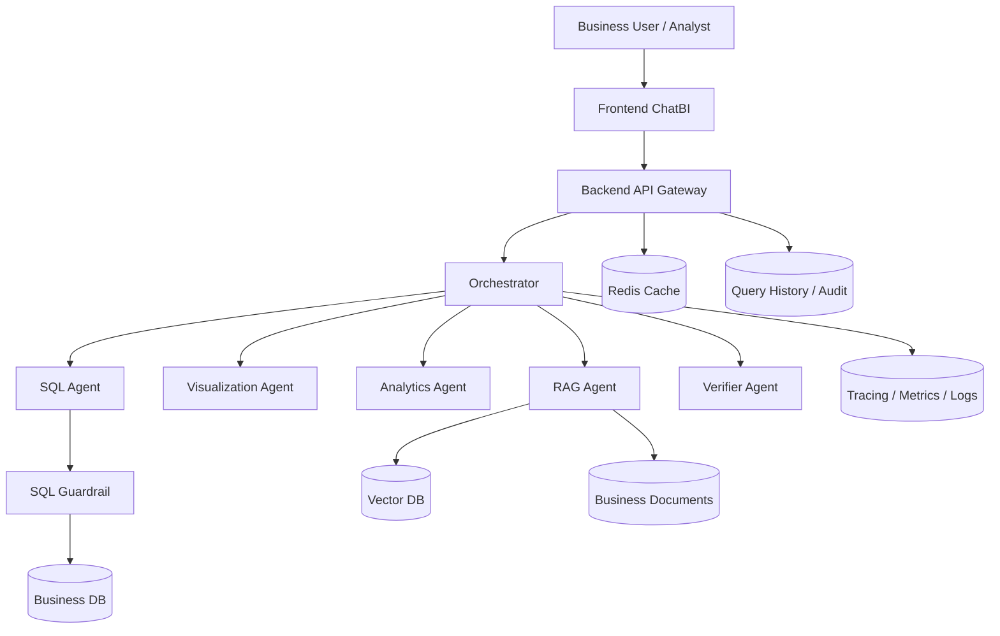

# 系统设计总索引（中文）

English Index: [system-design-index.en.md](system-design-index.en.md)

本页是 Governed Multi-Agent ChatBI Platform 10 份系统设计文档的统一入口。

## 目录

- [全局架构图](#全局架构图)
- [使用说明](#使用说明)
- [架构层](#架构层)
- [数据与治理层](#数据与治理层)
- [体验与智能层](#体验与智能层)
- [质量与运维层](#质量与运维层)
- [完整文档地图](#完整文档地图)
- [推荐阅读路径](#推荐阅读路径)

## 全局架构图

## 使用说明

1. 先阅读总体架构，建立系统边界和全局认知。
2. 再阅读数据与治理，明确口径、规则与接口契约。
3. 然后阅读前端与 RAG，理解用户体验与解释机制。
4. 最后阅读分析预测与评估观测，补齐生产可用能力。

快速跳转：

- [文档 01](#文档-01总体架构)
- [文档 02](#文档-02多智能体编排)
- [文档 03](#文档-03语义层与nl2sql)
- [文档 04](#文档-04sql-安全与治理)
- [文档 05](#文档-05数据模型)
- [文档 06](#文档-06后端-api)
- [文档 07](#文档-07前端-chatbi)
- [文档 08](#文档-08rag-检索与证据解释)
- [文档 09](#文档-09分析与预测)
- [文档 10](#文档-10评估与可观测性)

## 架构层

### 文档 01：总体架构

锚点：[文档 01](#文档-01总体架构)

- 中文：[01-overall-architecture/README.zh-CN.md](01-overall-architecture/README.zh-CN.md)
- 英文：[01-overall-architecture/README.en.md](01-overall-architecture/README.en.md)

摘要：

- 系统分层与运行时拓扑
- 从提问到验证输出的端到端流程
- 跨模块通用契约与治理基线

### 文档 02：多智能体编排

锚点：[文档 02](#文档-02多智能体编排)

- 中文：[02-agent-orchestration-design/README.zh-CN.md](02-agent-orchestration-design/README.zh-CN.md)
- 英文：[02-agent-orchestration-design/README.en.md](02-agent-orchestration-design/README.en.md)

摘要：

- Orchestrator 与专用 Agent 职责边界
- 调度策略、状态机、置信度聚合
- 降级与局部失败处理机制

## 数据与治理层

### 文档 03：语义层与NL2SQL

锚点：[文档 03](#文档-03语义层与nl2sql)

- 中文：[03-semantic-layer-and-nl2sql/README.zh-CN.md](03-semantic-layer-and-nl2sql/README.zh-CN.md)
- 英文：[03-semantic-layer-and-nl2sql/README.en.md](03-semantic-layer-and-nl2sql/README.en.md)

摘要：

- 业务语义模型与指标治理
- NL 解析、SQL 规划生成、解释机制
- 版本管理与语义歧义回退

### 文档 04：SQL 安全与治理

锚点：[文档 04](#文档-04sql-安全与治理)

- 中文：[04-sql-guardrail-and-governance/README.zh-CN.md](04-sql-guardrail-and-governance/README.zh-CN.md)
- 英文：[04-sql-guardrail-and-governance/README.en.md](04-sql-guardrail-and-governance/README.en.md)

摘要：

- SQL 规则引擎与 AST 校验
- 权限控制、脱敏、限流限时限量
- 审计与回放能力

### 文档 05：数据模型

锚点：[文档 05](#文档-05数据模型)

- 中文：[05-data-model-design/README.zh-CN.md](05-data-model-design/README.zh-CN.md)
- 英文：[05-data-model-design/README.en.md](05-data-model-design/README.en.md)

摘要：

- 业务、知识、运行、治理四类数据域
- ER 结构、血缘、分区、生命周期、质量规则
- OLTP、向量库、缓存、审计存储策略

### 文档 06：后端 API

锚点：[文档 06](#文档-06后端-api)

- 中文：[06-backend-api-design/README.zh-CN.md](06-backend-api-design/README.zh-CN.md)
- 英文：[06-backend-api-design/README.en.md](06-backend-api-design/README.en.md)

摘要：

- API 分组与端点清单
- 统一请求/响应/错误模型
- 幂等、分页、限流与观测契约

## 体验与智能层

### 文档 07：前端 ChatBI

锚点：[文档 07](#文档-07前端-chatbi)

- 中文：[07-frontend-chatbi-design/README.zh-CN.md](07-frontend-chatbi-design/README.zh-CN.md)
- 英文：[07-frontend-chatbi-design/README.en.md](07-frontend-chatbi-design/README.en.md)

摘要：

- 页面架构与组件体系
- 表格/图表/证据/风险结构化渲染
- 查询中、局部失败、降级状态体验

### 文档 08：RAG 检索与证据解释

锚点：[文档 08](#文档-08rag-检索与证据解释)

- 中文：[08-rag-design/README.zh-CN.md](08-rag-design/README.zh-CN.md)
- 英文：[08-rag-design/README.en.md](08-rag-design/README.en.md)

摘要：

- 接入、切片、向量化、检索、重排
- 证据引用结构与约束
- 忠实度控制与无依据陈述抑制

## 质量与运维层

### 文档 09：分析与预测

锚点：[文档 09](#文档-09分析与预测)

- 中文：[09-analytics-and-forecasting-design/README.zh-CN.md](09-analytics-and-forecasting-design/README.zh-CN.md)
- 英文：[09-analytics-and-forecasting-design/README.en.md](09-analytics-and-forecasting-design/README.en.md)

摘要：

- 时序预处理与异常检测
- 预测策略与降级路径
- 可解释分析与不确定性表达

### 文档 10：评估与可观测性

锚点：[文档 10](#文档-10评估与可观测性)

- 中文：[10-evaluation-and-observability/README.zh-CN.md](10-evaluation-and-observability/README.zh-CN.md)
- 英文：[10-evaluation-and-observability/README.en.md](10-evaluation-and-observability/README.en.md)

摘要：

- 离线评估 + 在线 SLO 监控
- 告警、回放、发布门禁
- 持续质量改进闭环

## 完整文档地图

### 文档 01：总体架构

- 中文：[01-overall-architecture/README.zh-CN.md](01-overall-architecture/README.zh-CN.md)
- 英文：[01-overall-architecture/README.en.md](01-overall-architecture/README.en.md)

### 文档 02：多智能体编排

- 中文：[02-agent-orchestration-design/README.zh-CN.md](02-agent-orchestration-design/README.zh-CN.md)
- 英文：[02-agent-orchestration-design/README.en.md](02-agent-orchestration-design/README.en.md)

### 文档 03：语义层与NL2SQL

- 中文：[03-semantic-layer-and-nl2sql/README.zh-CN.md](03-semantic-layer-and-nl2sql/README.zh-CN.md)
- 英文：[03-semantic-layer-and-nl2sql/README.en.md](03-semantic-layer-and-nl2sql/README.en.md)

### 文档 04：SQL 安全与治理

- 中文：[04-sql-guardrail-and-governance/README.zh-CN.md](04-sql-guardrail-and-governance/README.zh-CN.md)
- 英文：[04-sql-guardrail-and-governance/README.en.md](04-sql-guardrail-and-governance/README.en.md)

### 文档 05：数据模型

- 中文：[05-data-model-design/README.zh-CN.md](05-data-model-design/README.zh-CN.md)
- 英文：[05-data-model-design/README.en.md](05-data-model-design/README.en.md)

### 文档 06：后端 API

- 中文：[06-backend-api-design/README.zh-CN.md](06-backend-api-design/README.zh-CN.md)
- 英文：[06-backend-api-design/README.en.md](06-backend-api-design/README.en.md)

### 文档 07：前端 ChatBI

- 中文：[07-frontend-chatbi-design/README.zh-CN.md](07-frontend-chatbi-design/README.zh-CN.md)
- 英文：[07-frontend-chatbi-design/README.en.md](07-frontend-chatbi-design/README.en.md)

### 文档 08：RAG 检索与证据解释

- 中文：[08-rag-design/README.zh-CN.md](08-rag-design/README.zh-CN.md)
- 英文：[08-rag-design/README.en.md](08-rag-design/README.en.md)

### 文档 09：分析与预测

- 中文：[09-analytics-and-forecasting-design/README.zh-CN.md](09-analytics-and-forecasting-design/README.zh-CN.md)
- 英文：[09-analytics-and-forecasting-design/README.en.md](09-analytics-and-forecasting-design/README.en.md)

### 文档 10：评估与可观测性

- 中文：[10-evaluation-and-observability/README.zh-CN.md](10-evaluation-and-observability/README.zh-CN.md)
- 英文：[10-evaluation-and-observability/README.en.md](10-evaluation-and-observability/README.en.md)

## 推荐阅读路径

### 路径 A：架构优先

1. [文档 01](#文档-01总体架构)
2. [文档 02](#文档-02多智能体编排)
3. [文档 06](#文档-06后端-api)
4. [文档 10](#文档-10评估与可观测性)

### 路径 B：数据安全优先

1. [文档 05](#文档-05数据模型)
2. [文档 03](#文档-03语义层与nl2sql)
3. [文档 04](#文档-04sql-安全与治理)
4. [文档 08](#文档-08rag-检索与证据解释)

### 路径 C：体验优先

1. [文档 07](#文档-07前端-chatbi)
2. [文档 06](#文档-06后端-api)
3. [文档 09](#文档-09分析与预测)
4. [文档 10](#文档-10评估与可观测性)

---

## 锚点区

### 文档 01：总体架构

### 文档 02：多智能体编排

### 文档 03：语义层与NL2SQL

### 文档 04：SQL 安全与治理

### 文档 05：数据模型

### 文档 06：后端 API

### 文档 07：前端 ChatBI

### 文档 08：RAG 检索与证据解释

### 文档 09：分析与预测

### 文档 10：评估与可观测性
