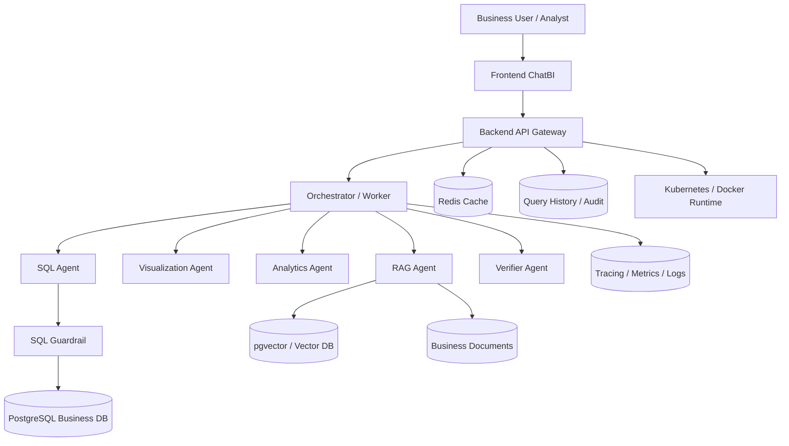

# System Design Parts List

## 1. Purpose

This document is based on the main README and lists all system parts that require dedicated design work. It serves as the master checklist for architecture design, module design, API design, data design, and evaluation design. The repository now includes v2 engineering upgrade documents that move the initial framework toward database connectivity, Docker-based local development, frontend/backend integration, Kubernetes deployment, and observable runtime operations.

The final industrial submission design has been added under [final-version/README.md](final-version/README.md). The English version is available at [final-version/en/README.en.md](final-version/en/README.en.md), and the Chinese version is available at [final-version/zh-CN/README.zh-CN.md](final-version/zh-CN/README.zh-CN.md). This document set extends the engineering MVP into a final architecture blueprint suitable for director-level review and cloud deployment planning.

The project is positioned as an enterprise decision-intelligence, multi-agent ChatBI platform. Therefore, the design scope should cover not only chat interaction, but also data governance, security governance, explainability, evaluation, observability, and engineering delivery.

---

## 2. Scope Overview

It is recommended to split system design into the following 10 top-level domains:

1. Product and business workflow design
2. Multi-agent collaboration architecture design
3. NL2SQL and semantic layer design
4. SQL safety and governance design
5. Data query and analytics capability design
6. RAG retrieval and evidence-grounded explanation design
7. Frontend interaction and visualization design
8. Backend services and API design
9. Data layer and storage design
10. Evaluation, audit, monitoring, and operations design

### 2.1 v2 Engineering Upgrade Scope

The v2 design adds the following production-oriented capabilities across the 10 design areas:

1. Database: PostgreSQL main storage, Redis cache, pgvector/vector store, migrations, seed data, and backups.
2. Docker: local Compose topology for frontend, backend, worker, database, cache, and vector retrieval.
3. Frontend/backend: unified REST API, response envelope, trace id, long-running task state, and history replay.
4. Kubernetes: Deployments, Services, Ingress, ConfigMaps, Secrets, probes, and scaling.
5. Observability and governance: metrics, logs, traces, audit, eval runner, and release gates.

v2 document entry points:

1. Overall Architecture v2: [English](01-overall-architecture/VERSION2.en.md) / [Chinese](01-overall-architecture/VERSION2.zh-CN.md)
2. Agent Orchestration v2: [English](02-agent-orchestration-design/VERSION2.en.md) / [Chinese](02-agent-orchestration-design/VERSION2.zh-CN.md)
3. Semantic Layer and NL2SQL v2: [English](03-semantic-layer-and-nl2sql/VERSION2.en.md) / [Chinese](03-semantic-layer-and-nl2sql/VERSION2.zh-CN.md)
4. SQL Guardrail and Governance v2: [English](04-sql-guardrail-and-governance/VERSION2.en.md) / [Chinese](04-sql-guardrail-and-governance/VERSION2.zh-CN.md)
5. Data Model v2: [English](05-data-model-design/VERSION2.en.md) / [Chinese](05-data-model-design/VERSION2.zh-CN.md)
6. Backend API v2: [English](06-backend-api-design/VERSION2.en.md) / [Chinese](06-backend-api-design/VERSION2.zh-CN.md)
7. Frontend ChatBI v2: [English](07-frontend-chatbi-design/VERSION2.en.md) / [Chinese](07-frontend-chatbi-design/VERSION2.zh-CN.md)
8. RAG Retrieval and Evidence v2: [English](08-rag-design/VERSION2.en.md) / [Chinese](08-rag-design/VERSION2.zh-CN.md)
9. Analytics and Forecasting v2: [English](09-analytics-and-forecasting-design/VERSION2.en.md) / [Chinese](09-analytics-and-forecasting-design/VERSION2.zh-CN.md)
10. Evaluation and Observability v2: [English](10-evaluation-and-observability/VERSION2.en.md) / [Chinese](10-evaluation-and-observability/VERSION2.zh-CN.md)

### 2.2 Final Version Scope

The Final Version design does not replace the v2 documents. It adds the cross-cutting production capabilities required for an industrial submission:

1. User sign-up, sign-in, token/session handling, and password safety.
2. RBAC, admin-only APIs, and tenant isolation.
3. Real LLM API integration, LLM Provider Gateway, token/cost tracking.
4. Embeddings, vector database, RAG citations, and document permission filters.
5. Database migrations, small/medium/large seed data, and load-test data.
6. Kubernetes, managed cloud databases, secrets, ingress, TLS, and HPA.
7. Timeouts, retries, circuit breakers, rate limits, queues, and load testing.
8. Admin console, audit events, security observability, and OpenTelemetry/Prometheus/Grafana integration.
9. Final delivery roadmap, acceptance criteria, and go-live checklist.

Final Version document entry points:

1. Language index: [English/Chinese](final-version/README.md)
2. Master index: [English](final-version/en/README.en.md) / [Chinese](final-version/zh-CN/README.zh-CN.md)
3. Executive system design: [English](final-version/en/00-executive-system-design.en.md) / [Chinese](final-version/zh-CN/00-executive-system-design.zh-CN.md)
4. Production architecture: [English](final-version/en/01-production-architecture.en.md) / [Chinese](final-version/zh-CN/01-production-architecture.zh-CN.md)
5. Auth, RBAC, and tenant isolation: [English](final-version/en/02-auth-rbac-tenant-isolation.en.md) / [Chinese](final-version/zh-CN/02-auth-rbac-tenant-isolation.zh-CN.md)
6. LLM Provider Gateway: [English](final-version/en/03-llm-provider-gateway.en.md) / [Chinese](final-version/zh-CN/03-llm-provider-gateway.zh-CN.md)
7. Embedding, vector database, and RAG: [English](final-version/en/04-embedding-vector-rag.en.md) / [Chinese](final-version/zh-CN/04-embedding-vector-rag.zh-CN.md)
8. Data platform, migrations, and seed data: [English](final-version/en/05-data-platform-and-seed.en.md) / [Chinese](final-version/zh-CN/05-data-platform-and-seed.zh-CN.md)
9. Cloud and Kubernetes deployment: [English](final-version/en/06-cloud-kubernetes-deployment.en.md) / [Chinese](final-version/zh-CN/06-cloud-kubernetes-deployment.zh-CN.md)
10. Resilience, rate limiting, and scale: [English](final-version/en/07-resilience-and-scale.en.md) / [Chinese](final-version/zh-CN/07-resilience-and-scale.zh-CN.md)
11. Security, observability, and admin console: [English](final-version/en/08-security-observability-admin.en.md) / [Chinese](final-version/zh-CN/08-security-observability-admin.zh-CN.md)
12. Final delivery roadmap: [English](final-version/en/09-final-delivery-roadmap.en.md) / [Chinese](final-version/zh-CN/09-final-delivery-roadmap.zh-CN.md)

### 2.3 Overall Architecture Diagram

---

## 3. System Parts That Need Design

## 3.1 Product and Business Workflow Design

This part defines what capabilities the system provides and how user questions flow through the platform.

Sub-parts to design:

1. User role model
   Permission boundaries and usage patterns for Business Users, Data Analysts, and Engineering Teams.
2. Core business scenarios
   KPI query, comparative analysis, anomaly detection, trend forecasting, root-cause explanation, and follow-up analysis.
3. End-to-end workflow
   Full pipeline from user question to final answer: routing, validation, execution, explanation, verification, and response.
4. Conversation and context model
   Context retention in multi-turn sessions, follow-up handling, question rewriting, and previous-result references.
5. Response structure design
   Unified structure for textual insights, tables, charts, anomaly markers, forecasts, evidence references, and risk notices.

Design focus:

1. Define standard processing flows per question type.
2. Define a stable final-answer schema for frontend-backend-agent collaboration.

---

## 3.2 Multi-Agent Collaboration Architecture Design

The README already states an Orchestrator + Specialized Agents model. This must be designed as a dedicated subsystem.

Sub-parts to design:

1. Orchestrator Agent
   Intent recognition, task classification, decomposition, routing, and response aggregation.
2. SQL Agent
   Metric identification, SQL generation, SQL explanation, guardrail invocation, and query execution.
3. Visualization Agent
   Chart-type selection, chart spec generation, and sampling/aggregation for large result sets.
4. Analytics Agent
   Anomaly detection, forecasting, seasonality analysis, and trend interpretation.
5. RAG Agent
   Document retrieval, evidence extraction, and cause-hypothesis generation.
6. Verifier Agent
   SQL safety checks, metric-definition checks, consistency checks, and reliability scoring.
7. Agent communication protocol
   Input/output schema, status passing, error codes, and confidence fields.
8. Agent orchestration strategy
   Sequential/parallel paths, conditional branches, retries, timeout handling, and graceful degradation.

Design focus:

1. Keep agent responsibilities strictly separated.
2. Define unified intermediate data contracts to avoid integration chaos.

---

## 3.3 NL2SQL and Semantic Layer Design

This is one of the core foundations and should be designed from both semantic modeling and SQL generation perspectives.

Sub-parts to design:

1. Business semantic model
   Metric, dimension, time grain, filter, join path, and business aliases.
2. Metric definition standards
   Standardized definitions for core metrics such as revenue, refund_rate, and active_users.
3. Semantic configuration schema
   Schema, versioning, and extension rules for metrics.yaml (or equivalent).
4. Natural language parsing
   Extracting metric, dimension, time range, comparison targets, and analysis intent from user questions.
5. SQL generation strategy
   Selection among template-based, rule-based, LLM-based, or hybrid approaches.
6. SQL explanation generation
   User-facing explanations of SQL logic for transparency.
7. Pre-execution validation entry
   Data contract and timing for handing generated SQL to guardrails.

Design focus:

1. Semantic layer design should come before SQL behavior tuning.
2. Mapping rules from natural language to semantic objects must be explicit.

---

## 3.4 SQL Safety and Governance Design

This is a key requirement for enterprise readiness and a highlighted capability in the README.

Sub-parts to design:

1. SQL allowlist and denylist rules
   Allow SELECT only; block DROP, DELETE, UPDATE, INSERT, ALTER, and other risky statements.
2. SQL syntax and AST validation
   Check read-only compliance, risky functions, and unauthorized access patterns.
3. Row limit strategy
   Auto-limit policy, pagination strategy, and large-result controls.
4. Query timeout policy
   Timeout thresholds, cancellation handling, and user-visible timeout messages.
5. Table-level and field-level authorization
   Which roles can query which tables/columns and what requires masking.
6. Audit log model
   Persist user query, generated SQL, status, latency, errors, and rule hits.
7. Failure fallback policy
   Safe and clear user responses for blocked SQL, execution failures, and permission denials.

Design focus:

1. Cover both accidental errors and malicious use.
2. Governance must be enforced in backend rule layers, not only prompts.

---

## 3.5 Data Query and Analytics Capability Design

This part implements structured query computation and advanced analytics.

Sub-parts to design:

1. Query execution service
   DB connectivity, connection pooling, query executor, and normalized result format.
2. Multi-dimensional analysis
   Comparative analysis, grouped aggregations, trend analysis, and Top-N analysis.
3. Anomaly detection module
   Input/output contracts and strategy selection for Bollinger Bands, rolling mean/std, and SPC rules.
4. Forecasting module
   APIs, training windows, and confidence intervals for ARIMA and Prophet.
5. Model selection and fallback
   Method selection by data volume/cadence, and fallback behavior on failures.
6. Analytics-to-language rendering
   Converting statistical outputs into business-readable insights.

Design focus:

1. Analytics outputs must align with governed metric definitions.
2. Uncertainty disclosure must be part of final responses.

---

## 3.6 RAG Retrieval and Evidence Explanation Design

This part connects structured KPI changes with unstructured business context.

Sub-parts to design:

1. Document source model
   Weekly reports, release notes, campaign logs, support tickets, incidents, finance reports, external news.
2. Ingestion and chunking
   Cleaning, chunk strategy, metadata schema, time fields, and source fields.
3. Vector retrieval
   Embeddings, vector store selection, recall strategy, and metadata filters.
4. Hybrid retrieval
   Combining keyword retrieval with vector retrieval.
5. Evidence ranking and deduplication
   Ranking, dedupe, and clipping when multiple documents are retrieved.
6. Evidence citation format
   How final answers cite evidence and separate facts from hypotheses.
7. Faithfulness constraints
   Prevent fabricated causal claims; explicitly state uncertainty.

Design focus:

1. RAG must support explanation of metric changes, not generic retrieval.
2. Citation format must be explicit for audit and frontend display.

---

## 3.7 Frontend Interaction and Visualization Design

The README already defines concrete frontend pages and chart areas. Frontend requires dedicated system design.

Sub-parts to design:

1. ChatBI conversation page
   Input panel, message stream, follow-up entry points, suggested prompts, and status hints.
2. Query result presentation
   Tables, KPI summary cards, SQL explanation panel, error states, and empty-result states.
3. Chart rendering design
   Unified rendering protocol for time series, bar, comparison, anomaly, and forecast charts.
4. Query history page
   Past questions, SQL snapshots, timestamps, statuses, and replay links.
5. Dataset and metric management page
   Metric-definition browser, dataset metadata, and permission visibility.
6. Evaluation demo page
   Test cases, expected outputs, actual outputs, and scoreboards.
7. Frontend state management
   In-progress states, partial-success states, and failure states across agent workflows.

Design focus:

1. Frontend should render structured analytics outputs, not plain chat text only.
2. Visualization contracts must align with Visualization Agent output schema.

---

## 3.8 Backend Services and API Design

This part integrates frontend, agents, databases, vector stores, and evaluation capabilities.

Sub-parts to design:

1. API gateway or main backend
   Request entry, authentication, routing, and response aggregation.
2. AI service layer
   Prompt management, model invocation, agent orchestration, and result caching.
3. Query APIs
   Ask-question API, fetch-result API, query-history API.
4. Visualization and analytics APIs
   Chart spec response, anomaly output response, forecast response.
5. RAG retrieval APIs
   Retrieval requests, evidence payload, and source metadata payload.
6. Management APIs
   Metric config management, evaluation task management, and log queries.
7. Unified response and error model
   Error taxonomy, user-safe messages, and internal diagnostic fields.
8. Cache strategy
   Redis for hot queries, conversation context, and short-term result reuse.

Design focus:

1. API design should map directly to real page and agent integration needs.
2. A unified response schema is required for stable frontend and agent integration.

---

## 3.9 Data Layer and Storage Design

The README already lists recommended tables and storage components, so this layer needs complete modeling.

Sub-parts to design:

1. Business database schema
   orders, products, customers, regions, refunds, marketing_campaigns, web_events, support_tickets.
2. Metric lineage and governance model
   Source tables, joins, and conflict-resolution rules for metric definitions.
3. Vector database model
   Document vectors, metadata filtering, and index refresh policy.
4. Caching layer model
   Hot question cache, similar-question cache, and metric-definition cache.
5. Logging and audit storage
   Query history, agent traces, security interception records, and evaluation records.
6. Configuration storage
   Prompts, metric configs, permission rules, and model parameters.

Design focus:

1. Clearly separate business data, knowledge data, runtime data, and governance data.
2. Metric lineage should be documented with dedicated diagrams.

---

## 3.10 Evaluation, Audit, Monitoring, and Operations Design

The README explicitly requires evaluation, logging, and observability. This must be designed upfront.

Sub-parts to design:

1. SQL accuracy evaluation
   Correctness in table selection, field selection, aggregation, time filters, and metric definitions.
2. SQL safety evaluation
   Dangerous statement blocking, sensitive-field controls, and read-only guarantees.
3. Agent routing evaluation
   Whether each query type triggers the correct agent combination.
4. RAG faithfulness evaluation
   Correct retrieval, no unsupported claims, clear uncertainty expression.
5. Latency metrics
   SQL latency, RAG latency, forecast latency, and end-to-end workflow latency.
6. Observability model
   Trace IDs, step-level agent traces, error alerts, and performance dashboards.
7. Query history and audit replay
   Question replay, SQL replay, evidence replay, and postmortem support.
8. Deployment and environment setup
   env configuration, docker-compose, local dev setup, and test environment setup.

Design focus:

1. Define evaluation criteria in MVP phase, not after implementation.
2. Auditability and observability are key enterprise differentiators.

---

## 4. Recommended Design Priority

Suggested implementation order:

1. Overall architecture design
2. Multi-agent orchestration design
3. NL2SQL and semantic layer design
4. SQL guardrail and governance design
5. Data layer design
6. Backend API design
7. Frontend interaction and visualization design
8. RAG design
9. Analytics and forecasting design
10. Evaluation and observability design

Rationale:

1. The first four determine whether the platform can function correctly.
2. Data and API layers determine implementation feasibility.
3. RAG, analytics, and evaluation determine differentiation and trustworthiness.

---

## 5. Recommended Document Split

Recommended follow-up files under system_design:

1. 01-overall-architecture.md
2. 02-agent-orchestration-design.md
3. 03-semantic-layer-and-nl2sql.md
4. 04-sql-guardrail-and-governance.md
5. 05-data-model-design.md
6. 06-backend-api-design.md
7. 07-frontend-chatbi-design.md
8. 08-rag-design.md
9. 09-analytics-and-forecasting-design.md
10. 10-evaluation-and-observability.md

---

## 6. Conclusion

Based on the main README, this project requires far more than a single chat-system design. At minimum, the complete design scope includes:

1. Conversation and business workflow system
2. Multi-agent orchestration system
3. Semantic layer and NL2SQL system
4. SQL safety and governance system
5. Data query and analytics system
6. RAG retrieval and evidence explanation system
7. Frontend presentation and visualization system
8. Backend services and API system
9. Data and storage system
10. Evaluation, audit, monitoring, and operations system

These ten parts together form the complete system-design scope of an enterprise-grade ChatBI decision-intelligence platform.
